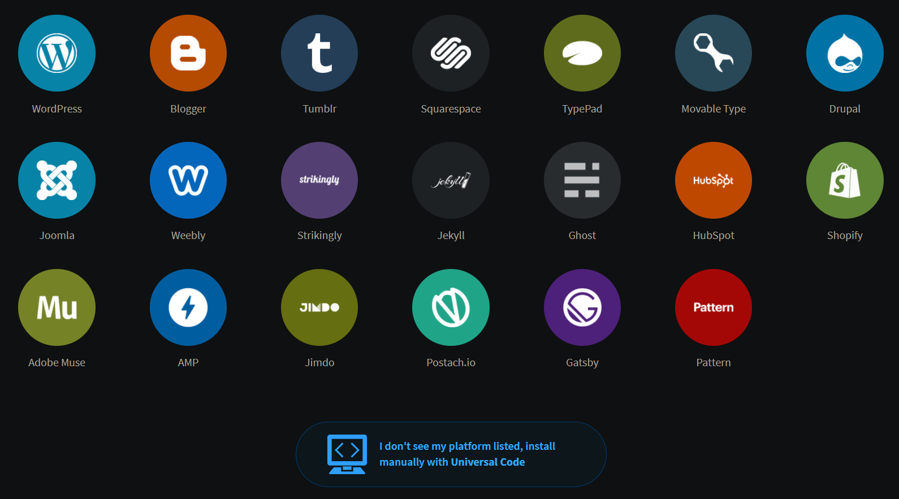

I wanted to add a comment section to this site to let people share their
thoughts on my posts, so I chose [Disqus](https://disqus.com) as the platform
for it seemed like the most popular option at the time.

## Register your site on Disqus

Go to the [Disqus site registration page](https://disqus.com/admin/create) and
register your site.

## Installation

Eventually, you'll see a page prompting you to select your site's platform:



Since Astro is not one of the options (sadly), you'll have to click **I don't
see my platform listed, install manually with Universal Code** on the bottom.

Once done, head over to your Astro project and create a component called
`Disqus.astro`. Copy the code given by the Universal Code prompt, and adapt it
to Astro which may look something like this:

```astro
<div id="disqus_thread"></div>
<script is:inline>
  function disqus_config() {
    this.page.url = PAGE_URL; // Replace PAGE_URL with your page's canonical URL variable
    this.page.identifier = PAGE_IDENTIFIER; // Replace PAGE_IDENTIFIER with your page's unique identifier variable
  }

  const d = document,
    s = d.createElement("script");
  s.src = "https://mysite.disqus.com/embed.js"; // Replace this with the URL you were given
  s.setAttribute("data-timestamp", (+new Date()).toString());
  (d.head || d.body).appendChild(s);
</script>
```

You may now add the Disqus widget anywhere on your site with:

```astro
---
import Disqus from "@components/Disqus.astro"; // Or wherever it is
---

<Disqus />
```

Good job! Now you have a comment section.

## Conclusion

Adding a comment section to my site was surprisingly easy thanks to Disqus. I
was honestly prepared to deal with keys and API tokens, but thankfully, I never
had to.
