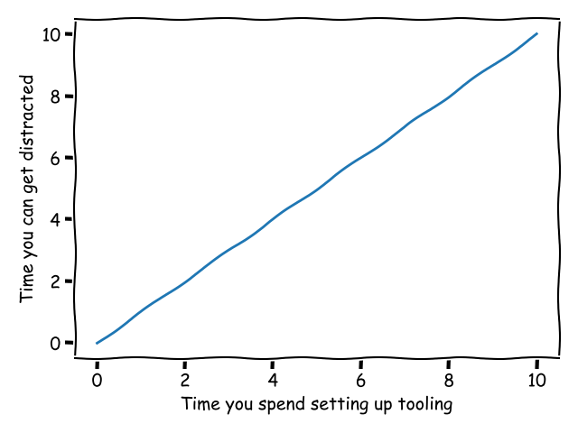

Don't start your projects with the configuration.

I learned this the hard way - when starting a project, I would usually configure
the linter and formatter thinking I was being productive (I was not), then
slowly lose motivation for the idea because of it.

## It takes longer than you think

Configuring code quality tooling seems like a trivial task - which it is, but it
takes longer than you would expect.

The amount of time you spend setting up your tooling is directly proportionate
to the time for you to potentially get distracted and think about new ideas,
since the task requires minimal thinking.

## Start with your idea instead

Instead of this strange procrastination method, just start coding your idea.
This helps you get into the "flow state" faster.

Once you get there and have some features done, you can start configuring your
tooling without getting distracted.
