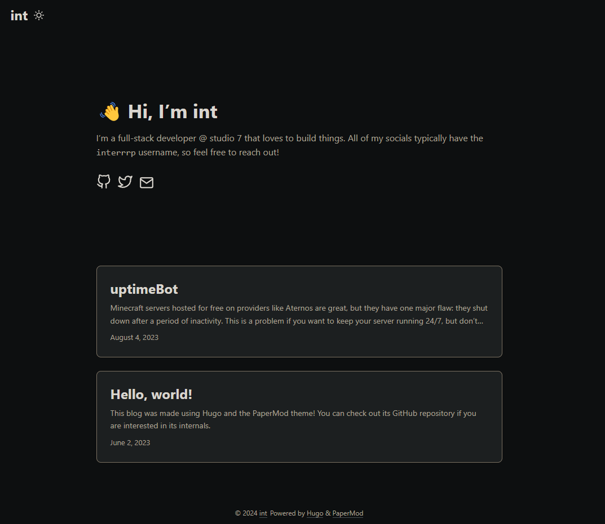
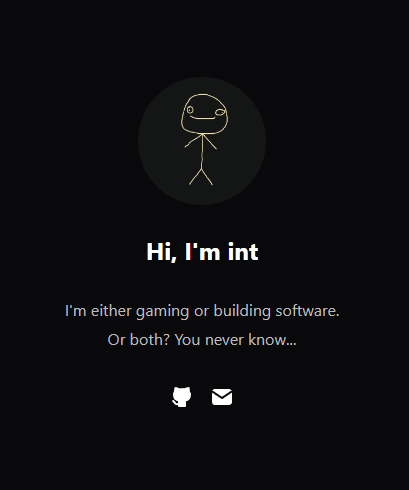
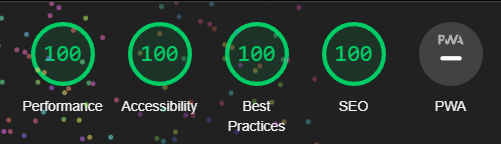

## Terrible pun, but what's an Astro?

This site is built using [Astro](https://astro.build), a content-based web framework and SSG.
It calls itself _"The web framework for content-driven websites"_ - and it wasn't lying! I had
a fun experience building this blog with it.

## Previous attempts

Prior to this version of the site, there were multiple attempts at one.

### [Hugo](https://gohugo.io) + [PaperMod](https://adityatelange.github.io/hugo-PaperMod)

One of the first attempts at a site involved a [static site generator (SSG)](https://en.wikipedia.org/wiki/Static_site_generator),
[Hugo](https://gohugo.io), and a minimal theme, [PaperMod](https://adityatelange.github.io/hugo-PaperMod).

In my opinion, it looked pretty bad because of the color scheme. I also didn't like Hugo because
of its configuration system; I can't remember what the exact problems were, but I only remember
that it was a pain to configure.

### [React](https://react.dev) + [TailwindCSS](https://tailwindcss.com)

The second iteration involved a static site built with [React](https://react.dev) and
[TailwindCSS](https://tailwindcss.com). It used [Vite](https://vitejs.dev) for the bundling,
minification, etc.

This one wasn't so bad, except for the fact that it had almost nothing on it. At some point after
I built the site, I realized that this setup with React and Tailwind was overkill for such a small
page. This led me to rewrite it in vanilla HTML, CSS, and JS.

### Vanilla HTML, CSS, and JS

_No screenshot for this one as it is exactly the same as the second iteration._

I rewrote the React and TailwindCSS site in vanilla HTML, CSS, and JS without any developer tooling.
This led to 100% Lighthouse scores:

Eventually, I realized that this site was useless. It provided literally no content for visitors.

### [Astro](https://astro.build) (this one)

The current (and hopefully final!) version of this site is built with [Astro](https://astro.build).
No words for this one, just explore the site yourself 😄

## Conclusion

Astro is an awesome web framework!

> Astro: The web framework for content-driven websites
